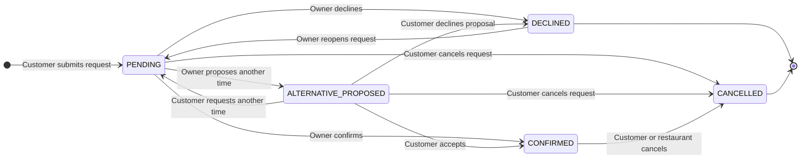
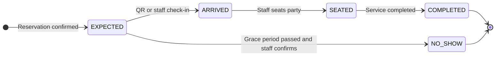

# Reservation Lifecycle

The reservation decision lifecycle and the restaurant visit lifecycle are separate. A confirmed reservation starts the visit lifecycle at `EXPECTED`.

## Reservation decision status

## Visit status

## Persistence rules

- `reservations.status` stores the current decision state.
- `reservations.visit_status` stores the current visit state and remains empty before confirmation.
- `reservation_proposals` stores every proposed alternative instead of overwriting proposal history.
- `reservation_events` records every transition with actor, time, and optional reason/context.
- Cancellation and no-show reasons belong in events; they should not become additional status values.
- Capacity updates and reservation status transitions must happen in one database transaction.
- Pending requests do not hold capacity in v1. Confirmation must lock and recheck the target slot before incrementing `capacity_reserved`.
- Every state-changing command must be idempotent. A repeated `command_id` returns the already-completed result without applying capacity or writing an event twice.

## Transition rules

| From | Action | Actor | To | Capacity effect |
| --- | --- | --- | --- | --- |
| New request | Submit | Customer | `PENDING` | None |
| `PENDING` | Confirm | Restaurant member | `CONFIRMED` + `EXPECTED` | Recheck and reserve `party_size` guests |
| `PENDING` | Confirm with capacity override | Authorized restaurant member | `CONFIRMED` + `EXPECTED` | Reserve `party_size`, mark the override, and audit the actor/context |
| `PENDING` | Decline | Restaurant member | `DECLINED` | None |
| `PENDING` | Expire after the restaurant-configured timeout | System | `EXPIRED` | None |
| `PENDING` | Propose alternative | Restaurant member | `ALTERNATIVE_PROPOSED` | None |
| `ALTERNATIVE_PROPOSED` | Accept | Customer | `CONFIRMED` + `EXPECTED` | Recheck and reserve proposed slot |
| `ALTERNATIVE_PROPOSED` | Decline | Customer | `DECLINED` | None |
| `ALTERNATIVE_PROPOSED` | Request another time | Customer | `PENDING` | None |
| `PENDING` / `ALTERNATIVE_PROPOSED` | Cancel | Customer | `CANCELLED` | None |
| `CONFIRMED` | Cancel | Customer or restaurant member | `CANCELLED` | Release `party_size` guests exactly once |
| `CONFIRMED` | Reschedule after customer/owner discussion | Restaurant member | `CONFIRMED` + `EXPECTED` | Atomically release old guest capacity and reserve new guest capacity |
| `DECLINED` | Reopen request | Restaurant member | `PENDING` | None |
| `EXPECTED` | Check in | Restaurant member using QR/manual lookup | `ARRIVED` | None |
| `ARRIVED` | Seat party | Restaurant member | `SEATED` | None |
| `SEATED` | Complete visit | Restaurant member | `COMPLETED` | None |
| `EXPECTED` | Mark no-show after grace period | Restaurant member | `NO_SHOW` | Capacity is not retroactively changed |

The backend returns these canonical states to customer, owner, and admin clients. UI labels may differ, but clients must not invent separate status values. Duplicate or overlapping customer reservations are not automatically cancelled; the UI may warn, and the parties resolve changes through reservation chat.

Timing guards come from `restaurant_booking_settings`: customer cancellation is allowed only before the configured cutoff, and no-show can be recorded only after `starts_at + no_show_grace_minutes`. The allowed check-in window still requires business confirmation.

## Proposal transaction

Proposal acceptance performs the following as one transaction:

1. Lock the reservation, proposal, and affected booking slots.
2. Verify that the proposal is still `PENDING` and the transition is allowed.
3. Verify capacity for the proposed slot and party-size bucket.
4. Release old capacity when changing an already-confirmed reservation.
5. Reserve new capacity, update the reservation, mark the proposal `ACCEPTED`, and append one event.

Any failure rolls back every step, preserving the previous reservation and capacity.

## Check-in token rule

- Only `check_in_token_hash` is stored; the raw token is never written to the database.
- A token is issued only for a confirmed reservation and delivered over an authenticated response.
- Reissuing a token replaces the stored hash and invalidates the previous token.
- Check-in validates the token, confirmed reservation, active restaurant membership, and `EXPECTED` visit state.
- The transition to `ARRIVED` and its actor/time event is written once; retrying the same command returns the existing result.

## Current implementation gap

The frontend prototype already supports pending requests, confirmation, owner decline, alternative proposals, customer responses, reopening, QR/staff check-in, arrival, seating, and completion. `CANCELLED`, `NO_SHOW`, account enforcement, capacity transactions, and idempotent reservation commands still need one consistent frontend/backend implementation.
