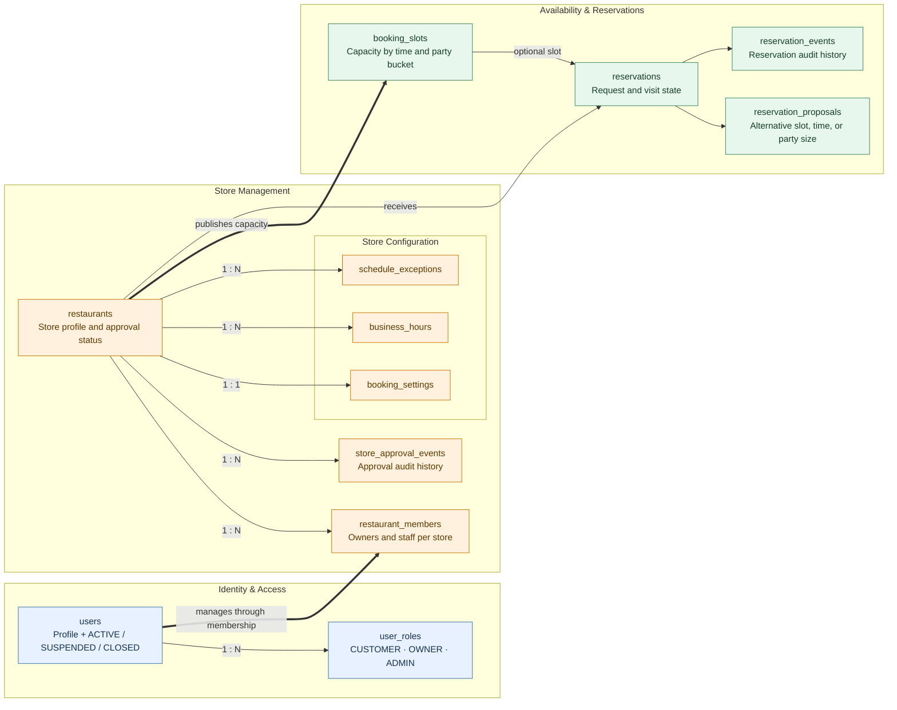

# Sibang Hankki Database Overview

This diagram is a simplified view of `schema.dbml`. The DBML file remains the source of truth for columns, indexes, constraints, and data types.

Legend:

- Solid arrows represent core ownership relationships.
- Thick arrows represent the primary store-to-booking flow.
- Actor/customer foreign keys are intentionally hidden here to prevent crossing lines; they remain visible in `schema.dbml`.

## Authorization model

| Check | Purpose |
| --- | --- |
| `users.status = ACTIVE` | Account may authenticate and perform actions. Account status overrides every role. |
| `user_roles` | Grants the global CUSTOMER, OWNER, or ADMIN workspace role. |
| Active `restaurant_members` row | Scopes OWNER/STAFF actions to a particular restaurant. |
| Resource attributes | Backend checks ownership, restaurant status, reservation status, and allowed transition for every request. |

Frontend visibility is not authorization. Every backend endpoint must apply these checks and deny by default.

## V1 capacity rule

- Capacity is measured in guests and configured independently by each restaurant.
- `capacity_total` is the number of guests supported for an interval; `capacity_reserved` is the sum of `party_size` for confirmed reservations occupying that interval.
- Dining duration, checkout hold, pending expiry, and confirmation mode are restaurant settings.
- Confirmation mode is `AUTO`, `MANUAL`, or `HYBRID`; hybrid mode also configures the minimum party size requiring manual confirmation.
- A pending reservation does not reserve capacity.
- Confirming a reservation rechecks capacity and increments `capacity_reserved` by `party_size` atomically.
- Normal confirmation cannot exceed `capacity_total`. An authorized restaurant member may explicitly override capacity; the reservation is marked and the actor is recorded in the audit event.
- Confirmed cancellation releases the reservation's `party_size` exactly once.
- Owner rescheduling releases old capacity and reserves new capacity in the same transaction while preserving an audit event.
- Accepting a proposal locks the affected slot rows, updates old/new capacity, updates the reservation, and marks the proposal accepted in one transaction.
- If any step fails, the transaction rolls back and the previous reservation remains unchanged.

## Retention and deletion

- Users are closed through `users.status`; referenced users are not hard-deleted.
- Restaurant access is revoked through `restaurant_members.revoked_at` instead of deleting membership history.
- Reservations are cancelled through status transitions and are never deleted as part of the normal workflow.
- Approval and reservation events are append-only audit records.

## Required PostgreSQL constraints

The future migration must enforce these rules in SQL, not only in Java:

- Positive party sizes, slot duration, booking window, cutoffs, and grace periods.
- `day_of_week` between 1 and 7 and valid opening/closing ranges.
- `capacity_total >= 0` and `capacity_reserved >= 0`; exceeding total capacity is allowed only through the explicit audited override workflow.
- Closed schedule exceptions have no opening range; open exceptions have both opening and closing times.
- At most one `PENDING` proposal per reservation, implemented as a partial unique index.
- Unique reservation creation `idempotency_key` and unique non-null event `command_id`.
- Foreign-key deletion uses `RESTRICT` for reservation/audit history; normal deletion is represented by status or revocation fields.

## Screen and API mapping

| Client action | Backend responsibility | Main tables |
| --- | --- | --- |
| Customer submits reservation | Validate active account/store/slot and create idempotently | `reservations`, `reservation_events` |
| Owner confirms or declines | Validate active membership and allowed transition | `reservations`, `booking_slots`, `reservation_events` |
| Owner proposes an alternative | Store proposed slot/time/party size without overwriting history | `reservation_proposals`, `reservation_events` |
| Customer accepts proposal | Recheck capacity and apply proposal atomically | `reservation_proposals`, `reservations`, `booking_slots`, `reservation_events` |
| Customer or owner cancels | Check actor and cutoff, release confirmed capacity once | `reservations`, `booking_slots`, `reservation_events` |
| Owner checks in guest | Validate token, store and membership, then transition once | `reservations`, `reservation_events` |
| Admin approves/suspends store | Validate admin role and append approval decision | `restaurants`, `store_approval_events` |

## Items still requiring business confirmation

- Default values and allowed bounds for restaurant capacity and timing settings.
- Chat persistence, retention, and notification requirements.
- Whether owner-initiated rescheduling requires explicit customer acceptance.
- Whether a proposal may change party size as well as date/time.
- Expected handling for party sizes above `maximum_online_party_size` but not above `large_party_threshold`.
- Data-retention duration for closed accounts and old reservations.
- Whether a reissued QR token should invalidate the previous token immediately.
